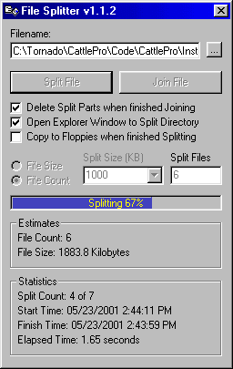

## Large File Splitter

### Description

Uses Windows API to properly split and join large files. This code is extremely efficient and will split a 14 meg file into 1 meg chunks in just over 5 seconds depending upon your harddrive speed. This is not a weak attempt at the Line function (Like some other posts). This is the real deal.   ** Updated Nov 30, 1999. ** Now includes split to file count or file size. Creates Batch file for quick rebuild and no longer needs the Common Controls or Common Dialog box OCXs. Uses API calls instead. Includes code for a simple Progress Bar Replacement.  ** Updated May 23, 2001 ** Added Copy to Floppy
 
### More Info
 
Requires Advanced programming skills

Always backup your files.

             |
---                |---
**Submitted On**   |2001-05-23 14:45:08
**By**             |[Paul Mather](https://github.com/Planet-Source-Code/PSCIndex/blob/master/ByAuthor/paul-mather.md)
**Level**          |Intermediate
**User Rating**    |4.8 (63 globes from 13 users)
**Compatibility**  |VB 5\.0, VB 6\.0
**Category**       |[Windows API Call/ Explanation](https://github.com/Planet-Source-Code/PSCIndex/blob/master/ByCategory/windows-api-call-explanation__1-39.md)
**World**          |[Visual Basic](https://github.com/Planet-Source-Code/PSCIndex/blob/master/ByWorld/visual-basic.md)
**Archive File**   |[Large File199535232001\.zip](https://github.com/Planet-Source-Code/paul-mather-large-file-splitter__1-3582/archive/master.zip)

